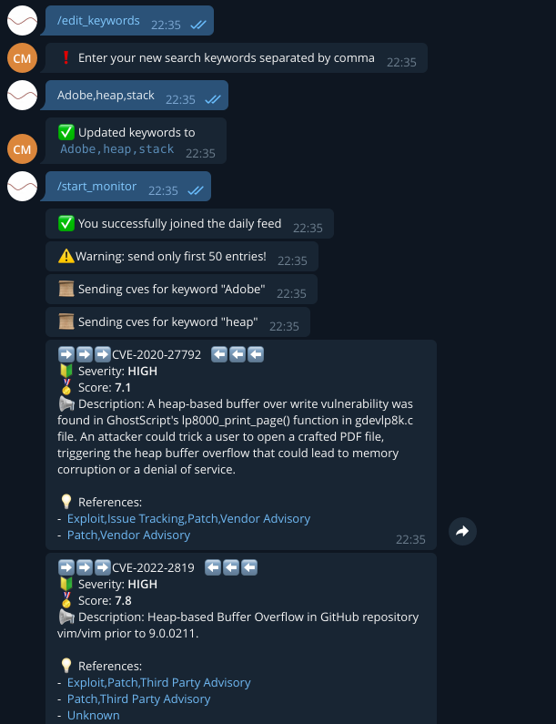

# telegramCVEFeed

### Description
Monitor nvd.nist.gov for new or modified cve records and receive daily reports in telegram. Currently, support search by specified keywords 

### TODO
 * Add more OOP
 * Send cves that created since last day
 * Add exclusion keywords

### How it looks

..... and more .....
